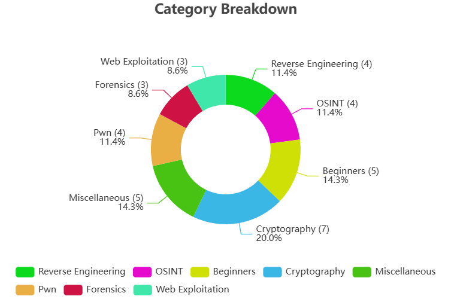

# World Wide CTF 2024

This repository contains official **source code** and **writeups** for challenges from [World Wide CTF 2024](https://ctftime.org/event/2572).

**Date and Time**: 30th November, 2024, 12:00 pm UTC to 1st December, 2024, 12:00 pm UTC
**Duration**: 24 hours

### Statistics

| Metric                                  | Value |
| --------------------------------------- | ----- |
| Total Registered Players                | 2332  |
| Total Registered Teams                  | 1215  |
| Total IP Addresses                      | 6793  |
| Teams That Solved at least one Challenge| 581   |
| Total Number of Challenges              | 35    |

### Sponsors
- Ottersec: https://www.osec.io/
- NordVPN: https://nordvpn.com/hackathons/
- NordPass: https://nordpass.com/
- Incogni: https://incogni.com/
- Saily: https://saily.com/
- SUD0ROOT: https://sud0root.com/
- Offsec: https://www.offsec.com/
- .XYZ: https://gen.xyz/
- Altered Security: https://www.alteredsecurity.com/
- Parrot CTFs: https://parrot-ctfs.com/
- Give My Certificate: https://givemycertificate.com/
- Infra sponsored by goo.gle/ctfsponsorship